### Hey, I'm Alex 👋

Lead Frontend Engineer at **All in Bits** — the company behind Cosmos, Tendermint, and Gno.

I build the TypeScript/JavaScript layer that connects developers and users to blockchain infrastructure: client libraries, code generators, wallets, governance dApps, indexers, and IBC relayers.

**Currently building:**
- [`gno-js-client`](https://github.com/gnolang/gno-js-client) / [`tm2-js-client`](https://github.com/gnolang/tm2-js-client) — official JS/TS clients for Gno (v2.0)
- [IBC v2 TypeScript Relayer](https://github.com/allinbits/ibc-v2-ts-relayer) — cross-chain relayer with Gno support
- [Eclesia Indexer](https://github.com/allinbits/eclesia-indexer) — high-performance blockchain indexer
- AtomOne & GovGen governance dApps, staking portal, bridging portal
- Contributing to [`gnolang/gno`](https://github.com/gnolang/gno) core

**Previously built:**
- TypeScript client codegen system for [Ignite CLI](https://github.com/ignite/cli) (1,350+ ⭐)
- [Emeris](https://github.com/EmerisHQ) — cross-chain DeFi aggregator (led 10 devs)
- [Castor Wallet](https://github.com/allinbits/multiwallet) — multi-chain Cosmos wallet
- [Beet](https://github.com/beetapp) — BitShares key/identity manager

**Stack:** TypeScript · Vue 3 · Go · Rust · Cosmos SDK · CometBFT · IBC · Gno · Protobuf · GraphQL

**Before blockchain:** 15 years in digital advertising → Head of Digital → multiple Ermis Awards → then fell down the rabbit hole in 2018 and never came back.

  
  

